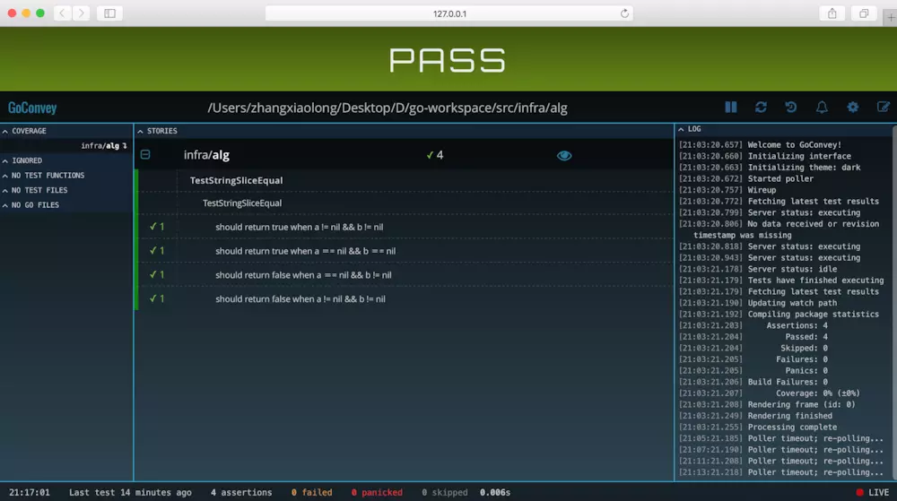

# GoConvey 测试框架使用指南

[主页](http://goconvey.co/) -
[Github](https://github.com/smartystreets/goconvey) -
[GoDoc](https://godoc.org/github.com/smartystreets/goconvey#pkg-subdirectories)

> convey :
> 表达，传达（思想、感情或想法）

GoConvey 是 Go 语言测试框架。作者使用 convey 作为架构名称以及最主要函数的名称，是希望测试程序，能够表达出代码运行方式。

GoConvey 的特性有：

1. 完全兼容 `go test`
1. 自动监控测试的 Web UI
1. 大型回归测试套件
1. 显示覆盖率（需要 go 1.2 及以上）
1. 已读并作色的终端输出
1. 测试代码生成
1. Web UI 可以利用浏览器的通知机制

## 安装

在命令行输入

```shell
go get github.com/smartystreets/goconvey
```

会下载 GoConvey 的源代码，并在 `$GOPATH/bin` 中生成 `goconvey` 可执行文件。

> 当 $GOPATH 中不止是一个目录的时候，可能无法正确地生成 $GOPATH/bin/goconvey

## 快速开始

```go
package package_name

import (
    "testing"
    . "github.com/smartystreets/goconvey/convey"
)

func TestSpec(t *testing.T) {
    // 只有顶层的 Convey 需要传递 t
    Convey("Given some integer with a starting value", t, func() {
        x := 0
        Convey("When the integer is incremented", func() {
            x++
            Convey("The value should be greater by one", func() {
                So(x, ShouldEqual, 1)
            })
        })
    })
}
```

注意事项：

1. 导入 convey 的时候，重命名为 "."，可以让后续的程序更通顺。
1. 只有顶层的 Convey 函数需要传入 t

### Web 测试报告



在命令行中跳转到测试文件所在的目录，并输入以下命令：

```shell
$GOPATH/bin/goconvey
```

会自动在浏览器中打开 `http://localhost:8080/` 页面，呈现以上界面。

GoConvey 会对文件夹进行持续监控，并报告多种测试结果。

### 命令行测试

当然，也可以 `go test` 工具运行单元测试。以下是 `./simple/simple_test.go` 的测试结果。

```shell
$ go test -v
=== RUN   TestSpec

  Given some integer with a starting value
    When the integer is incremented
      The value should be greater by one ✔

1 total assertion

--- PASS: TestSpec (0.00s)
PASS
ok      github.com/aQuaYi/Go-Notes/TestLib/goconvey/simple    0.001s
```

## 跳过测试

有的时候，某一处改动会带来多个测试断言的失败。为了一个接一个地处理失败的断言。 GoConvey 提供了跳过某个 Convey 或 So 的方法。

> 在 Convey 和 So 前面添加 Skip 即可。

[点击这里，查看 SkipConvey 和 SkipSo 的说明](https://godoc.org/github.com/smartystreets/goconvey/convey#SkipConvey)

SkipConvey 和 SkipSo 的内容会在 WEB 测试报告中，以 "S" 符号标记。

还可以，把顶层的 Convey 变成 FocusConvey，那么子 Convey 也需要被修改成 FocusConvey 才能被执行。

[点击这里，查看 FocusConvey 的说明](https://sourcegraph.com/-/godoc/refs?def=FocusConvey&pkg=github.com%2Fsmartystreets%2Fgoconvey%2Fconvey&repo=github.com%2Fsmartystreets%2Fgoconvey)

简单地说，`SkipConvey` 与 `FocusConvey` 具有正好相反的作用。

> 那 `SkipConvey` 与 `FocusConvey` 被嵌套在对方的下面时，会发生什么呢？请使用  `./simple/simple_test.go` 修成查验。

## convey 的隔离执行

当 convey 多层嵌套时，convey 的执行流程会与常识不同。建议仔细阅读 [isolated_execution_test.go](https://github.com/smartystreets/goconvey/blob/master/convey/isolated_execution_test.go) 中的测试代码，好好体会一下。

以下抽离了其中的一个片段来讲解。

```go
func TestNestedScopesWithIsolatedExecution(t *testing.T) {
    output := ""

    Convey("a", t, func() {
        output += "a "

        Convey("aa", func() {
            output += "aa "

            Convey("aaa", func() {
                output += "aaa | "
            })

            Convey("aab", func() {
                output += "aab | "
            })
        })

        Convey("ab", func() {
            output += "ab "

            Convey("aba", func() {
                output += "aba | "
                So(output, ShouldEqual, "a aa aaa | a aa aab | a ab aba | ")
            })
        })
    })

}
```

最后的断言，是不是有点意想不到。我对 convey 的理解是： 每个 convey 执行时，都会再执行一遍，同级以及上级 convey。另外由于闭包，output 会记录所有步骤的修改。

## 定制断言函数

[这里](https://godoc.org/github.com/smartystreets/goconvey/convey#pkg-variables)罗列了 GoConvey 中的原生断言函数，全部以 Should 开头。

实际上，原生断言函数只是 [assertions](https://github.com/smartystreets/assertions) 库中函数的别名。

[assertions](https://github.com/smartystreets/assertions) 中的函数的类型，全部都是

> func(actual interface{}, expected ...interface{}) string

[assertions/filter.go](https://github.com/smartystreets/assertions/blob/master/filter.go) 中定义了断言函数的使用方法。

于是，我们可以自定义断言函数

```go
func ShouldSummerBeComing(actual interface{}, expected ...interface{}) string {
    if actual == "summer" && expected[0] == "coming" {
        return "" // 返回空字符串表示成功。
    }
    return "Summer is not coming."
}
```

完整代码在[这里](summer/summer_test.go)

## 自动生成测试代码

在定义好了测试流程与内容后，可以利用 Web UI 的代码生成功能，自动生成代码。

点击 Web UI 右上角的  按钮。


在页面的左边，填写测试流程。页面的右边，就会自动生成测试代码的框架。

> 注意：左边使用 **tab** 进行缩进

## Reset 函数

```go
func Reset(action func())
```

一般用来注册清理函数，**因为每次与 Reset 处于相同作用域的 Convey 执行完毕后， Reset 都会被调用一次**。

##